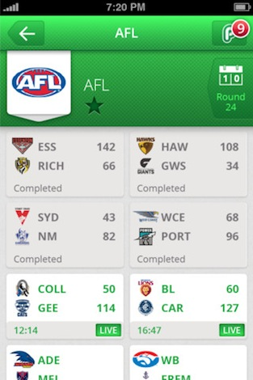
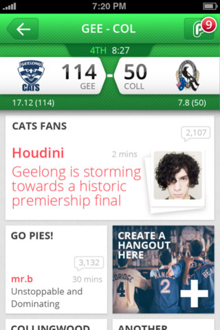
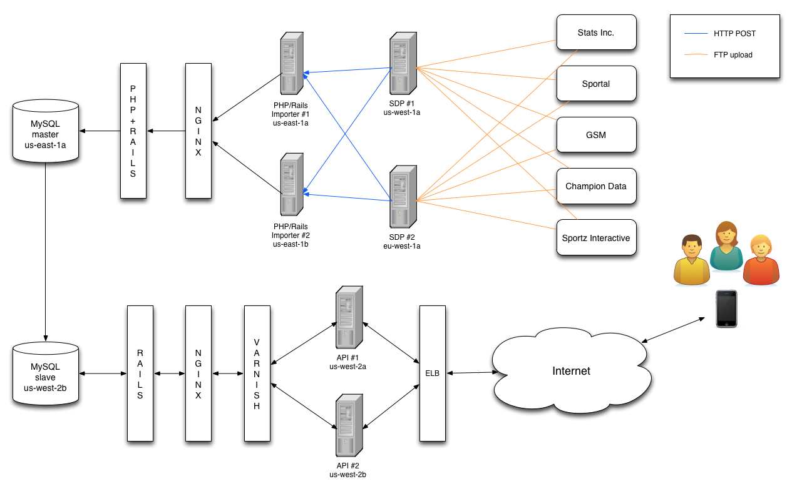
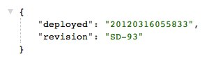

!SLIDE

# Deployment & Operations  at PlayUp #

 
### Ash McKenzie ###
#### March 27th 2012 ####

!SLIDE bullets

.notes Developing software I found was more rewarding for me, but still really enjoyed getting down and dirty at the OS level
  
# About me #

* Sys Admin nine or so years
* Have worked with Solaris, RedHat EL, Gentoo
* Developer five or so years
* Have worked with Perl, PHP and now Ruby
* Switched to development as enjoyed creative aspect

!SLIDE bullets

* We build applications and games around live sport
* We're obsessed with sport, ALL sport!
* Offices in eight countries
* Majority of development in Melbourne office
* Just released v2 of our iOS app, WOOT!
* Web app [http://beta.playup.com](http://beta.playup.com)
* Android app (coming soon)

!SLIDE bullets smbullets

# Sports Data Team #

* Team of five, all in Melbourne
* Develop Sports Data API
* Process incoming sport XML  from five providers for nine sports with 54 leagues
* Equates to roughly 25,000 contests a year
* Constantly adding new sports and leagues

!SLIDE bullets smbullets

.notes AWS ELB is great in it's simplicity and easy to setup but is pretty limited

# JSON API #

* Consistent across all sports, RESTful and discoverable
* Each sport, league, round and constest has a unique UID - great for caching
* Utilise HTTP Accept header for versioning
* Rails based
* Use (and love) Varnish
* Utilise AWS ELB, not too bad

!SLIDE

# Sample JSON #

## Cricket contest ##

!SLIDE[tpl=code]

.notes :type defines the HTTP Content-Type header

  <pre>
    {
    ":self": "http://some.server.com/contests/20110159536",
    ":uid": "contest-20110159536",
    ":type": "application/vnd.playup.sport.contest.cricket.test+json",
    "contest_details": {
      ":self": "http://some.server.com/contest_details/20110159536",
      ":uid": "contest_details-20110159536",
      ":type": "application/vnd.playup.sport.contest_detail.cricket.test+json"
    },
    "scheduled_start_time": "2012-03-22T21:30:00Z",
    "start_time": "2012-03-22T21:30:00Z",
    "last_modified": "2012-03-27T02:43:27Z",
    "title": "New Zealand vs South Africa",
    "short_title": "NZ vs SA",
    "round_name": "MAR",
    "competition_name": "Test Cricket",
    "sport_name": "Cricket",
    "annotation": "4th",
    "ancestors": [
      {
        ":self": "http://some.server.com/rounds/2177",
        ":uid": "round-2177",
        ":type": "application/vnd.playup.sport.round+json"
      },
      {
        ":self": "http://some.server.com/leagues/95",
        ":uid": "competition-95",
        ":type": "application/vnd.playup.sport.competition+json"
      },
      {
        ":self": "http://some.server.com/sports/1",
        ":uid": "sport-1",
        ":type": "application/vnd.playup.sport.sport.cricket+json"
      },
      {
        ":self": "http://some.server.com/sports",
        ":uid": "sports",
        ":type": "application/vnd.playup.sport.sports+json"
      }
    ],
    "scores": [
      {
        "total": 106,
        "wickets": 5,
        "player": {
          "firstName": "Kane",
          "lastName": "Williamson",
          "role": "batsman",
          "stats": "61(125)"
        },
        "striker": {
          "first_name": "Kane",
          "last_name": "Williamson",
          "stats": "61(125)"
        },
        "non_striker": {
          "first_name": "Kruger",
          "last_name": "Wyk",
          "stats": "7(28)"
        },
        "summary": "106/5",
        "team": {
          ":self": "http://some.server.com/teams/21",
          ":uid": "team-21",
          ":type": "application/vnd.playup.sport.team+json",
          "name": "New Zealand",
          "short_name": "NZ",
          "nick_name": "",
          "logos": {
            "header": [
              {
                "density": "low",
                "href": "http://some.server.com/team-logos/cricket/cricket_new_zealand_nz_70x46.png"
              },
              {
                "density": "medium",
                "href": "http://some.server.com/team-logos/cricket/cricket_new_zealand_nz_105x69.png"
              },
              {
                "density": "high",
                "href": "http://some.server.com/team-logos/cricket/cricket_new_zealand_nz_140x92.png"
              }
            ],
            "calendar": [
              {
                "density": "low",
                "href": "http://some.server.com/team-logos/cricket/cricket_new_zealand_nz_35x23.png"
              },
              {
                "density": "medium",
                "href": "http://some.server.com/team-logos/cricket/cricket_new_zealand_nz_53x35.png"
              },
              {
                "density": "high",
                "href": "http://some.server.com/team-logos/cricket/cricket_new_zealand_nz_70x46.png"
              }
            ]
          }
        }
      },
      {
        "total": 189,
        "wickets": 3,
        "summary": "189",
        "team": {
          ":self": "http://some.server.com/teams/20",
          ":uid": "team-20",
          ":type": "application/vnd.playup.sport.team+json",
          "name": "South Africa",
          "short_name": "SA",
          "nick_name": "",
          "logos": {
            "header": [
              {
                "density": "low",
                "href": "http://some.server.com/team-logos/cricket/cricket_south_africa_sa_70x46.png"
              },
              {
                "density": "medium",
                "href": "http://some.server.com/team-logos/cricket/cricket_south_africa_sa_105x69.png"
              },
              {
                "density": "high",
                "href": "http://some.server.com/team-logos/cricket/cricket_south_africa_sa_140x92.png"
              }
            ],
            "calendar": [
              {
                "density": "low",
                "href": "http://some.server.com/team-logos/cricket/cricket_south_africa_sa_35x23.png"
              },
              {
                "density": "medium",
                "href": "http://some.server.com/team-logos/cricket/cricket_south_africa_sa_53x35.png"
              },
              {
                "density": "high",
                "href": "http://some.server.com/team-logos/cricket/cricket_south_africa_sa_70x46.png"
              }
            ]
          }
        }
      }
    ],
    "clock": {
      "overs": "45.0",
      "run_rate": "2.35",
      "last_ball": "1",
      "annotation": "play in progress",
      "summary": "Ov:45.0   RR:2.35   LastBall:1"
    }
  }
  </pre>

!SLIDE bullets

# Our clients #

.notes some of the clients that consume our API

* PlayUp iOS app (v2 now out)
* PlayUp Android app (coming soon)
* A number of internal R&D apps

!SLIDE

.notes iOS app and some secret squirrel stuff

!SLIDE bullets

# Current Infrastructure #

!SLIDE bullets

.notes We have two SDP boxes in two different AWS regions

# Current Infrastructure #

## SDP - Sports Data Procurement ##

* Two AWS instances - one in us-west-1 and another in eu-west-1
* Handles incoming XML from data providers
* Routes the XML to the appropriate server and end point
* Archives XML older than 24 hours, nice nad neat
* We can receive up to 3GB of XML a day
* Some providers send XML every 20 seconds (lots of dupes)

!SLIDE bullets

# Current Infrastructure #

## Importer ##

* Two AWS instances in us-east-1
* Processes XML sent from SDP
* Extracts fixtures and live sport data
* Handles a myriad of XML structures, can be time consuming
* Creates new Teams as necessary
* Extracts events e.g. rebound, steal, 3 points (still brewing)
* Writes to MySQL master database

!SLIDE bullets

# Current Infrastructure #

.notes discoverable meaning JSON has links to other JSON

## API ##

* Two AWS instances in us-west-1
* RESTful, discoverable JSON API
* AWS ELB -> Varnish -> nginx -> Passenger -> Rails
* Vary our Cache-Control HTTP header depending on the content - short for live contests - longer for finished contests
* Reads from replicated MySQL slave

!SLIDE

# Network diagram #

!SLIDE[tpl=code]

!SLIDE

.notes Lets talk about developmet and deployment,
how we used to work
and how we work now

# Development & Deployment #

## Past & present ##

!SLIDE bullets smbullets

# Past #

* AWS based
* Very little automated testing
* Production deployment once or twice a week
* Deployment was basic shell scripts and a bit voodoo-esque and not under source control *gasp*
* Difficulty keeping environments in sync
* Devs had limited responsibility after commit

!SLIDE

# Present #

!SLIDE bullets smbullets

.notes Github flow master branch always deployable, 
  pull requests great for code review, 
  build lights are great - highly visible

# Development #

* Still AWS based
* Follow the 'Github flow' process
* Take full advantage of Github's pull request system
* Use git commit tags for clarity e.g. [api, db_schema]
* Jenkins CI performs all our tests via a build pipeline
* Automated UAT deployment upon green light
* Use of build lights, CCMenu offline CI notifications

!SLIDE bullets smbullets

# Production deployment #

* Shared / rotating role between team members
* From commit to production in under 30 mins
* Deployment is a push button affair
* Deploy three to eight times a week
* We deploy frequently so:
  * Deployed code is small and easily reversible
  * Stay as close as practical to our UAT env
* Deploy sends email with git commit log
* Service description JSON dropped upon success
* 

!SLIDE

# Future setup #

## What's brewing ? ##

!SLIDE bullets

.notes CentOS AMI's had to be built by hand,
Upstart is great, starts a service and will keep an eye on it,
We find more up-to-date packages in Ubuntu,
Putting OS holy wars aside, maintaining consistency in your environments is important

# Switching to Ubuntu 10.04 #

* Canonical provided community Ubuntu AMI's (we where home grown CentOS)
* Upstart out-of-the-box
* Suits our software requirements better
* Remain consistent going forward

!SLIDE bullets

# AWS auto scaling #

* Manually add more servers as we process more
* Automatically add more servers when demand escalates
* Allows us to drink more coffee :)

!SLIDE bullets

.notes Need a new server, easy!  
  Just select a preexisting configuration or pick and choose a new one
  Deploying configuration raises the age old question of what to do with credentials, but there are workarounds

# Puppet / Chef provisioning #

* Need a new server ? Easy!
* Pick and choose components and build a new system
* Deploy server configuration as part of code base

!SLIDE bullets

.notes Deliver real-time events via PUB/SUB or similar mechanism,
  Gets you even closer to the action,
  Support as many languages possible.. we are quite a fair away along with this,
  Increase the depth of information we provide in our API without adversely affecting performance

# Sports Data future #

* Real-time sport events using PUB/SUB
* Support as many languages as possible
* Increase depth of information in our API

!SLIDE bullets smbullets

.notes RDS not used to cross region replication can occur,
Why Munin ?  No DB required, just Perl with RRDtool

# Technology #

* Ruby 1.9, PHP 5
* nginx, Passenger, Varnish
* MySQL (not RDS), Redis
* New Relic RPM, Munin, Nagios
* RVM (personally prefer rbenv)
* Capistrano, delayed_job

!SLIDE bullets

# Challenges #

* Incoming sport XML accuracy
* JSON API data validation
* Centralising API cache
* PHP and Ruby in one codebase (effectively two apps)
* Reduce Jenkins CI processing time

!SLIDE bullets smbullets

.notes It's incredibly rewarding being involved in building and maintaining the infrastructure as well as writing and deploying the code,
Sharing the deployment 'makes it real' and by that I mean you're now responsible for the outcome of the deployment during and after,
Who is responsible for what is more and more becoming a difficult question
Puppet and chef allows a Dev to solve the problem of server setup using their favourite language, lowers the bar

# DevOps: Thoughts #

* Incredibly rewarding being involved with infrastructure and code
* Sharing deployment makes you think carefully about commits
* The ever shifting invisible line of responsibility.
* Cloud computing makes the question of responsibility even more difficult. I can accidentally **destroy** a server with a few clicks!
* Tools like Puppet and Chef allow Devs to better understand infrastructre setup
* Devs need to be acutely aware of affecting performance and system integrity when deloying
* Deploying to a system you do not accurately understand should never happen!

!SLIDE bullets incremental

.notes If possible pair with a Dev or an Ops guru and get a better understanding of challenges he or she faces.
Small changes to your process may make someone elses job much easier

# DevOps: How we can improve #

## 'Us' and 'them' talk limited but still exists ##

* Break it down with some pairing  

!SLIDE bullets incremental

# DevOps: How we can improve #

## More cuddles ##

* 

!SLIDE bullets smbullets

# DevOps: How we can improve #

## More cuddles ##

* Communication really is the key
* Myriad of ways to communicate, IRC is great!
* Deployment email is a great way to communicate what has changed
* A pre-deployment email about what is going to change is even better
* Completely open up the monitoring system (within reason) so everyone has visibility
* Display monitoring, system stats etc on a giant screen so it's impossible to miss

!SLIDE 

# Lastly #

!SLIDE

# DevOps: How we can improve #

## Experiment and innovate, try Vagrant! ##

!SLIDE bullets smbullets

# DevOps: How we can improve #

## Experiment and innovate, use Vagrant ##

* Vagrant is a Ruby based gem that controls VirtualBox via its API
* VirtualBox is a free cross platform virtualization solution (think VMWare workstation)
* Easily experiment with Puppet / Chef and Operating Systems
* Thrash and burn environments at will, risk free

!SLIDE

# And that's all! #

!SLIDE bullets smbullets

# Thank-you! #

* Github flow [http://scottchacon.com/2011/08/31/github-flow.html](http://scottchacon.com/2011/08/31/github-flow.html)
* Github pull requests [http://help.github.com/pull-requests](http://help.github.com/pull-requests)
* CCMenu [http://ccmenu.sourceforge.net](http://ccmenu.sourceforge.net)
* rbenv [https://github.com/sstephenson/rbenv](https://github.com/sstephenson/rbenv)
* upstart [http://upstart.ubuntu.com](http://upstart.ubuntu.com)
* Vagrant [http://vagrantup.com](http://vagrantup.com)